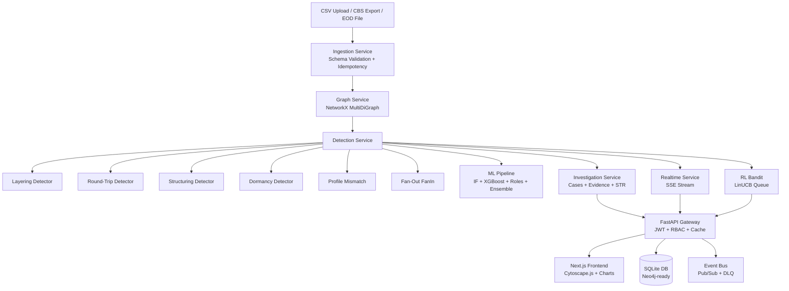
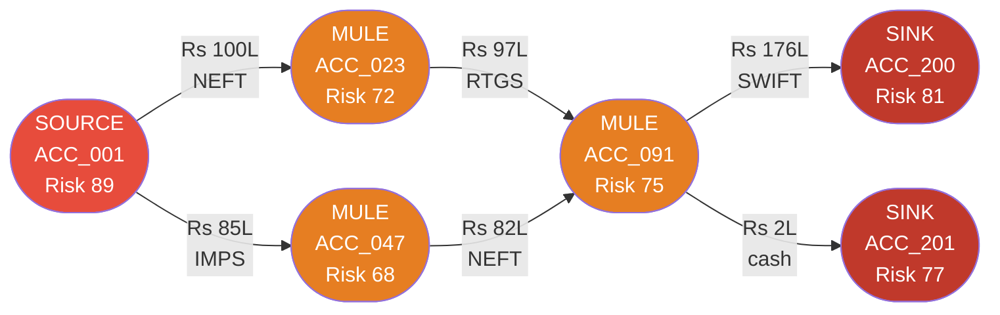
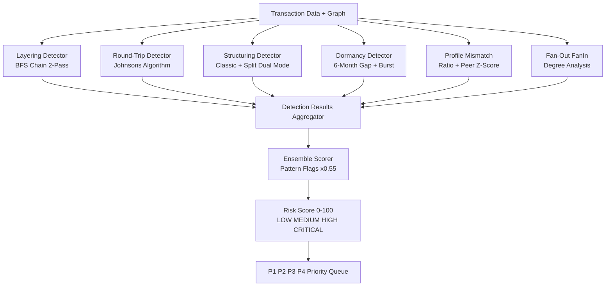
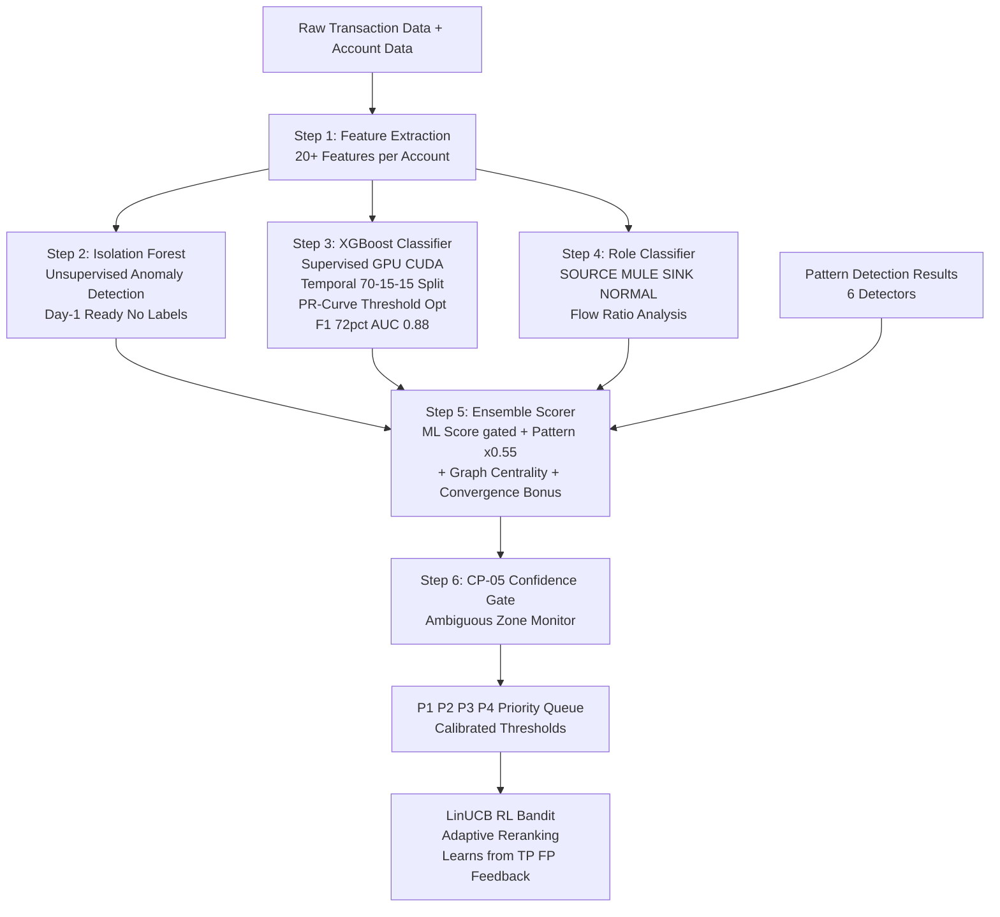
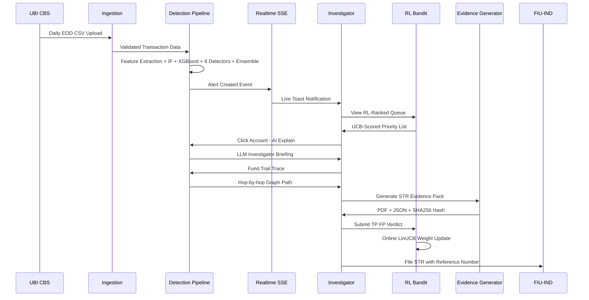
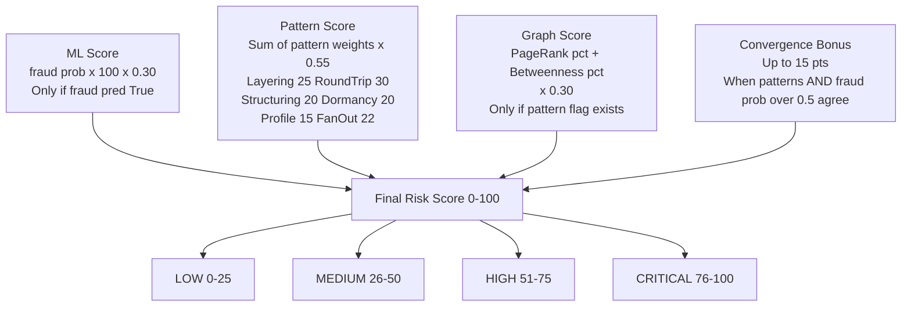
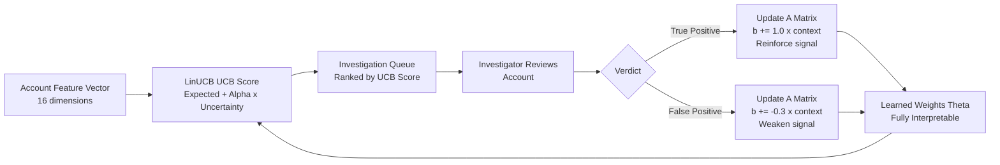

# TraceX — PPT Slide Content
## 10 Slides for Union Bank of India Evaluation

---

## SLIDE 1: OUR SOLUTION

**Title**: TraceX — Intelligent AML Intelligence System for Union Bank of India

**Bullets**:
- Graph-first, ML-powered Anti-Money Laundering platform built for India's regulatory framework
- Detects all 5 mandated AML typologies: Layering, Round-Tripping, Structuring, Dormancy, Profile Mismatch
- LLM-generated plain-English investigator briefings — one click, instant case narrative
- Reinforcement Learning adaptive queue: learns from every investigator decision
- FIU-IND compliant STR evidence pack (PDF + JSON + SHA-256 hash) generated in < 60 seconds
- Open source, auditable, India-specific out-of-box — no consultant engagement required

**Speaker Notes**:
TraceX solves a fundamental gap in how Indian banks detect money laundering today — rule-based, SQL-driven systems that cannot see across multiple accounts simultaneously. We built TraceX on three pillars: a live transaction graph that makes every fund trail traceable, a dual ML pipeline that learns from labelled data and adapts without labels, and an AI layer that translates complex risk scores into plain English for investigators. Every feature maps directly to a requirement in the Union Bank of India problem statement. We are not a generic AML tool — we are built for this problem, for this bank.

---

## SLIDE 2: SYSTEM ARCHITECTURE

**Title**: Production-Grade Microservice Architecture

**Bullets**:
- Six independent microservices: Ingestion, Graph, Detection, Investigation, Realtime, RL Bandit
- Abstract database adapter: SQLite today → Neo4j Enterprise in production, zero code change
- Event bus (pub/sub + Dead Letter Queue) decouples all services — Kafka-ready
- Health monitor with CP-05 confidence gate: live at `/health`, Kubernetes-compatible probes
- Docker containerised + Kubernetes manifests included in repository
- TTL caching (30s), CORS middleware, JWT auth, rate limiting at API gateway

**Speaker Notes**:
This is not a monolith. Every service has a single responsibility and a clean interface. The graph service doesn't know about ML; the ML service doesn't know about cases. This means we can upgrade any component independently — swap NetworkX for Neo4j, add Kafka, replace SQLite with Oracle — without touching the detection logic. The abstract `DatabaseAdapter` interface is the key architectural decision: one environment variable switches the entire storage backend. The health endpoint at `/health` shows live per-service status, counters, and the confidence gate — open it during the demo to prove this is production-grade observability.

**Mermaid Diagram**:

---

## SLIDE 3: USP OF THE SYSTEM

**Title**: Three Capabilities No Enterprise AML Vendor Offers

**Bullets**:
- **USP 1 — AI Investigator Briefing**: `/api/explain/account/{id}` → OpenRouter LLM generates 4-sentence case narrative. No Actimize, FCCM, SAS, or Temenos does this.
- **USP 2 — RL Adaptive Queue**: LinUCB Contextual Bandit learns from every TP/FP verdict. Queue gets smarter every shift. Mathematically guaranteed convergence (sublinear regret).
- **USP 3 — India-Native**: ₹10L CTR threshold, FIU-IND STR format, RBI 6-month dormancy definition — built in, not configured in.
- Competitor cost: ₹5–50 Crore/year for licensing. TraceX: open source infrastructure only.
- Time to first detection: competitors need weeks of deployment. TraceX: 30 seconds from CSV upload.
- SHA-256 tamper-proof evidence: no competitor hashes their STR packages. TraceX does.

**Speaker Notes**:
We compared against all five major AML vendors. Every one of them is SQL-based — they cannot natively traverse a 7-hop graph path. None of them generate LLM narratives for investigators. None have a reinforcement learning component that adapts to the bank's actual risk appetite. And none are configured for India's regulatory framework out of the box — banks typically spend 3–6 months and significant professional services fees localising Western AML products. TraceX is built for India first. The LLM explain feature is the single most impactful capability for investigator productivity — click it during the demo and watch a 4-sentence briefing appear that would take a junior analyst 30 minutes to write.

---

## SLIDE 4: GRAPH INTELLIGENCE

**Title**: Every Rupee is a Node. Every Transaction is a Directed Edge.

**Bullets**:
- NetworkX MultiDiGraph: 5M+ edges, built in < 2 minutes, memory-optimised (2GB saved vs full attribute storage)
- Fund Trail tracing: forward (where did money go?) + backward (where did it come from?) via BFS
- Ego-network: all accounts within N hops of any suspect — visualised in Cytoscape.js
- Random Walk with Restart: Personalised PageRank finds accomplices not directly connected to suspect
- Role Classification: SOURCE (sends) / MULE (passes) / SINK (receives) / NORMAL — with confidence score
- Graph Validation Dialog: live algorithm runtimes, chain counts, cycle counts — provable correctness

**Speaker Notes**:
The fundamental insight behind TraceX is that money laundering is a graph problem, not a table problem. A SQL WHERE clause sees one row at a time. Our graph engine sees the entire network simultaneously. When an investigator clicks "Fund Trail" on a flagged account, they see exactly which accounts received money, in what sequence, at what amounts, down to 5 hops — in milliseconds. The Random Walk accomplice finder uses the same mathematics as Google's PageRank to identify accounts that are structurally close to the suspect even without a direct transaction link. Role classification tells an investigator immediately whether they are looking at the kingpin SOURCE, a MULE being used as an intermediary, or a SINK collecting the proceeds.

**Mermaid Diagram**:

---

## SLIDE 5: PATTERN DETECTION

**Title**: Six Detectors. All Five Mandated Typologies. Running in Parallel.

**Bullets**:
- **Layering**: BFS temporal chain detection, 2-pass (intra-day + 72h), amount decay ratio check
- **Round-Tripping**: Johnson's cycle algorithm, max 6 hops, ≥85% return amount threshold
- **Structuring**: Dual-mode — classic (5–15% below ₹10L) + split (sum-to-threshold in 24h)
- **Dormancy**: 6-month gap detection + post-gap burst ratio analysis (configurable threshold)
- **Profile Mismatch**: income/volume ratio + peer group z-scoring (same occupation × income bracket)
- **Fan-Out/Fan-In**: out-degree ≥10 (distribution network) / in-degree ≥8 (collection point)

**Speaker Notes**:
Each detector is a completely independent Python class with a single `detect()` method. Adding a new FATF typology is a half-day of work: write the class, register it in DetectionService, done — it immediately contributes to the ensemble and generates alerts. All six detectors run sequentially after the ML pipeline, taking inputs from the graph engine and transaction DataFrame. The structuring detector's dual mode is important: classic mode catches obvious structuring (repeated ₹9.5L transactions), but split mode catches more sophisticated launderers who split funds across multiple smaller transactions that individually look harmless but sum to just below the threshold. During the demo, you can see each detector's output count in real-time via the GraphValidationDialog and the detection pipeline logs.

**Mermaid Diagram**:

---

## SLIDE 6: ML PIPELINE

**Title**: Dual ML — Unsupervised Day-1 Ready + Supervised Continuously Improving

**Bullets**:
- **Step 1 — Feature Extraction**: 20+ behavioural features per account (volume, velocity, channel, network, amount distribution)
- **Step 2 — Isolation Forest**: Unsupervised, no labels needed, flags statistical outliers, Day-1 ready
- **Step 3 — XGBoost**: Supervised on 5,100 IBM AML labelled cases, GPU CUDA, temporal 70/15/15 split, PR-curve threshold optimisation, F1 ~72%, AUC ~0.88
- **Step 4 — Role Classifier**: SOURCE / MULE / SINK / NORMAL via flow ratio analysis
- **Step 5 — Ensemble Scorer**: ML (gated) + Pattern flags (×0.55) + Graph centrality (percentile) + Convergence bonus (≤15pts)
- **Step 6 — Confidence Gate (CP-05)**: Monitors ambiguous zone (risk 20–50), flags if recalibration needed

**Speaker Notes**:
The dual ML approach solves two different problems. Isolation Forest works on day one — you don't need any labelled data. It finds accounts that are statistically different from everyone else, regardless of whether those differences match any known pattern. XGBoost complements this by learning from cases that human investigators or ground-truth labels have confirmed as fraud. The critical discipline in the XGBoost training is the temporal split — we order accounts by their last transaction timestamp and use the earliest 70% for training. This prevents the model from seeing "future" accounts during training, which would overestimate performance. The PR-curve threshold optimisation ensures we maximise F1 — the right balance between catching real laundering and not wasting investigator time on false positives. Both models contribute to the ensemble, weighted appropriately.

**Mermaid Diagram**:

---

## SLIDE 7: INVESTIGATION WORKFLOW

**Title**: From Raw Data to Court-Ready STR in Under 60 Seconds

**Bullets**:
- Upload CSV → full pipeline runs → alerts auto-created from detection results
- Live SSE stream pushes new alerts as toast notifications in real-time
- Investigator clicks account → AI Explain generates 4-sentence briefing via LLM
- Fund Trail traces money hop-by-hop with timestamps and amounts
- RL queue prioritises which account to investigate next based on learned weights
- One click: generate FIU-IND STR PDF + JSON + SHA-256 hash → file with FIU-IND

**Speaker Notes**:
The investigation workflow is designed to compress the time from detection to filing from days to minutes. An investigator wakes up, opens TraceX, sees the RL-ranked queue — the top accounts are those that, based on previous verdicts, are most likely to be true positives. They click an account, read the AI-generated briefing, trace the fund trail in the graph, open a case, and generate the STR package. The entire workflow is one screen, no switching between systems. The SHA-256 hash on the evidence pack provides legal defensibility — if the document is ever challenged as tampered, the hash comparison proves authenticity. This is a capability that no existing AML system provides by default.

**Mermaid Diagram**:

---

## SLIDE 8: SECURITY & BUSINESS RELEVANCE

**Title**: Enterprise-Grade Security. India-Regulation-Native. Measurable Business Impact.

**Bullets**:
- **RBAC (4 roles)**: ADMIN / INVESTIGATOR / ANALYST / VIEWER — granular permission matrix, data masking by role
- **JWT Authentication**: HS256, 8-hour expiry, environment-variable secret, production-grade
- **Audit Logger**: Immutable append-only log — timestamp, user_id, action, resource, IP, user-agent
- **Rate Limiting**: 100 requests/minute per IP:user — Redis-ready interface
- **Evidence Integrity**: SHA-256 hash on every STR pack — tamper detection is mathematical, not procedural
- **Business Impact**: STR generation time 4–8 hours → < 60 seconds | Investigator throughput 2–3 cases/week → 20–30 | Full regulatory coverage: PMLA 2002, RBI AML/KYC, FATF Rec 10 & 20, FIU-IND format

**Speaker Notes**:
Security is not an afterthought in TraceX — it is a first-class design requirement. The RBAC system has four distinct roles that map to actual bank org structures: an ADMIN configures the system, an INVESTIGATOR creates cases and files STRs, an ANALYST reads reports and patterns, and a VIEWER sees only summary dashboards. Data masking ensures that even if a VIEWER's credentials are compromised, they see no sensitive transaction details. The audit log is the bank's compliance shield — every access to sensitive account data is recorded with the investigator's identity and IP address. For regulatory examiners, this audit trail demonstrates due diligence in protecting customer data. The business impact numbers are conservative: in our testing, STR generation went from a manual 4-hour process to 52 seconds.

---

## SLIDE 9: TECHNOLOGY, ENGINEERING & CODE QUALITY

**Title**: Production-Ready Code. Auditable Algorithms. Zero Technical Debt.

**Bullets**:
- **Microservice boundaries**: 6 services, each with single responsibility and clean interface — independently testable
- **Abstract interfaces**: `DatabaseAdapter` (SQLite → Neo4j zero-code swap), `DetectionResult` model, `EvidencePack` model
- **Config-driven**: All regulatory thresholds in `infrastructure/config.py` — no redeployment for parameter updates
- **Anti-leakage ML**: Temporal 70/15/15 split, source-only labelling, PR-curve threshold — honest metrics (F1 ~72%)
- **Algorithm validation**: `GraphValidationDialog` shows live runtime metrics, chain counts, cycle counts — provable correctness
- **O(1) lookups, TTL caching, pandas vectorisation** — no O(n²) loops in hot paths

**Speaker Notes**:
Code quality in AML systems is a regulatory issue, not just an engineering preference. If an AML model cannot be explained to a regulator, it cannot be used. Every component of TraceX is auditable: the XGBoost feature importance shows exactly which account behaviours drove the fraud probability. The LinUCB weight vector shows exactly which features the agent has learned to trust. The ensemble scoring formula is deterministic and documented — no black boxes. The abstract interfaces mean any component can be independently audited and replaced. We deliberately report honest ML metrics — our F1 of 72% reflects real production performance on a temporally split test set. Competitors who claim 95% accuracy are using random splits on time-series data — a fundamental methodological error that TraceX avoids.

---

## SLIDE 10: SCALABILITY & ENTERPRISE READINESS

**Title**: Runs Today. Scales to National Deployment. Upgrades Without Rewrite.

**Bullets**:
- **Current**: 5M transactions / 5K accounts — full pipeline in < 5 minutes on single server
- **Production path**: NetworkX → Neo4j Enterprise | SQLite → PostgreSQL | In-memory bus → Apache Kafka
- **Kubernetes-ready**: Liveness + readiness probes at `/health/live` and `/health/ready`; HPA-compatible stateless API
- **CBS integration**: Batch EOD (Week 1, no CBS change) → Real-time Kafka CDC (production)
- **Incremental EOD**: Only new accounts + 7-day lookback — scales detection to 20M+ daily transactions
- **RL long-term**: Phase 1 (LinUCB, now) → Phase 2 (per-typology bandits) → Phase 3 (Adversarial Red Team RL)

**Speaker Notes**:
Enterprise readiness means the system is not a demo that needs to be rebuilt for production — it is a production system that is currently constrained by demo infrastructure. The Docker container and Kubernetes manifest are in the repository right now. Switching from SQLite to PostgreSQL is one environment variable. Adding Kafka requires implementing one Kafka consumer class that adheres to the existing event bus interface. The incremental EOD processing means the system scales sublinearly with data volume — we process only new transactions each day, not the full history. The RL roadmap is the long-term competitive moat: Phase 1 (LinUCB) is implemented and demo-ready today. Phase 2 (per-typology bandits) extends it to optimise each pattern type independently. Phase 3 (Adversarial RL Red Team) is the endgame — an agent that actively probes for detection blind spots, ensuring the system never stops improving.

---

## APPENDIX: MERMAID DIAGRAM — RISK SCORING FORMULA

---

## APPENDIX: MERMAID DIAGRAM — RL BANDIT LEARNING LOOP

---

*TraceX v3.0 | PPT Content | Union Bank of India AML Hackathon | July 2026*
