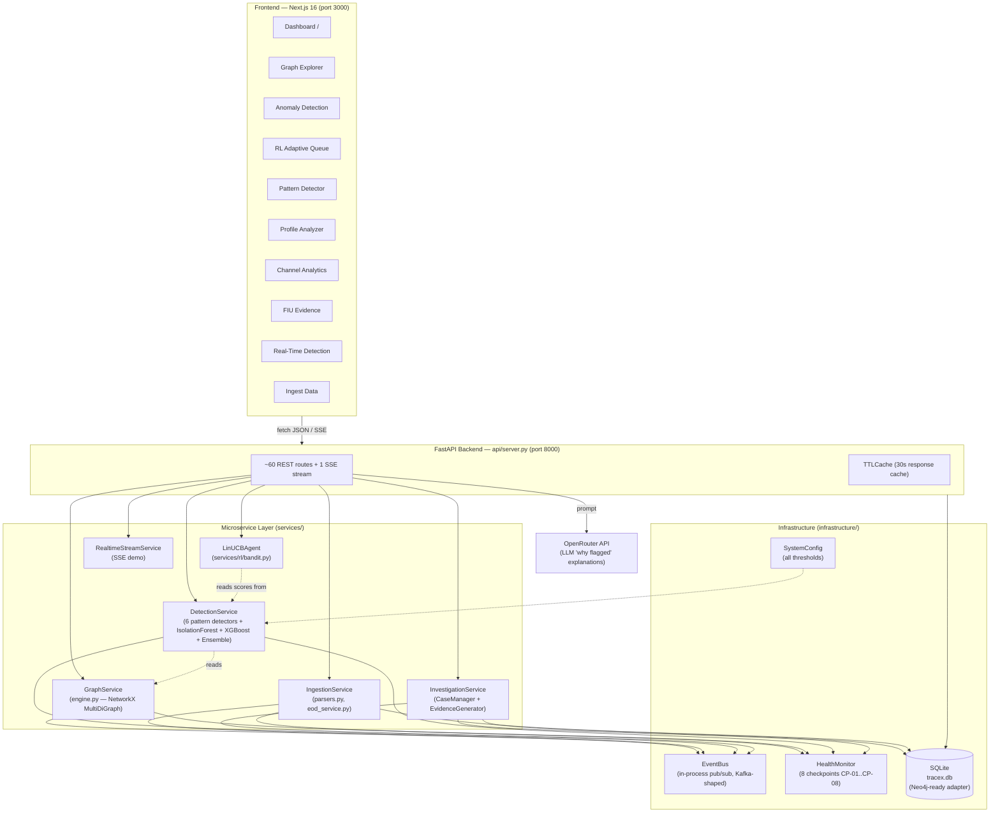
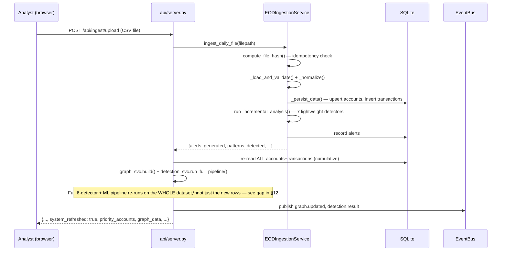
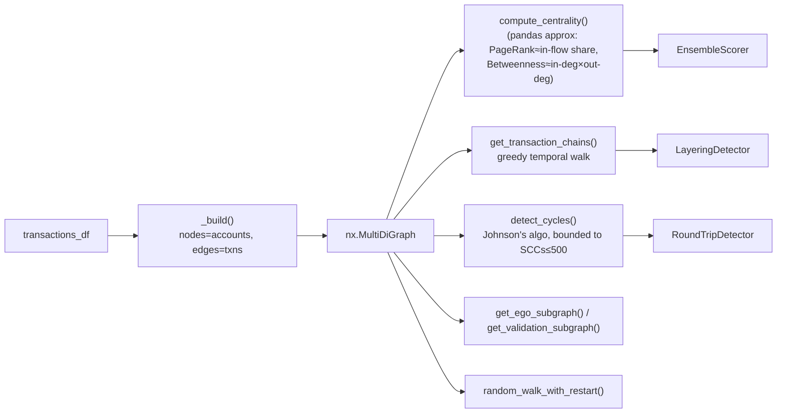
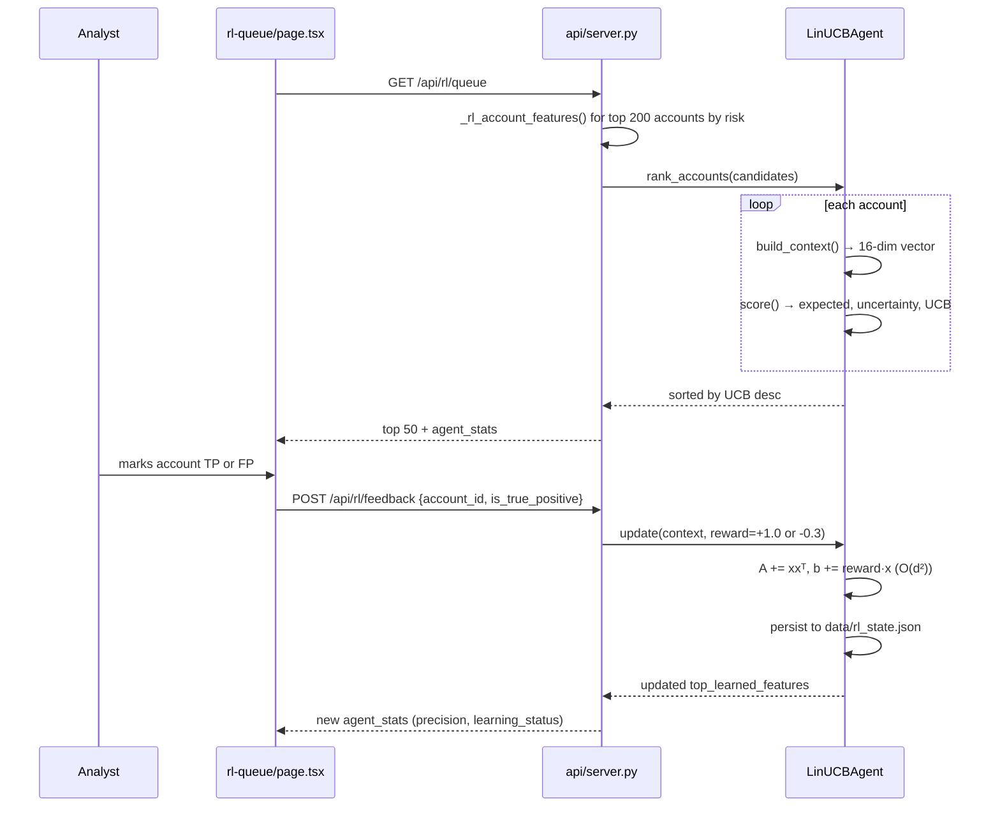
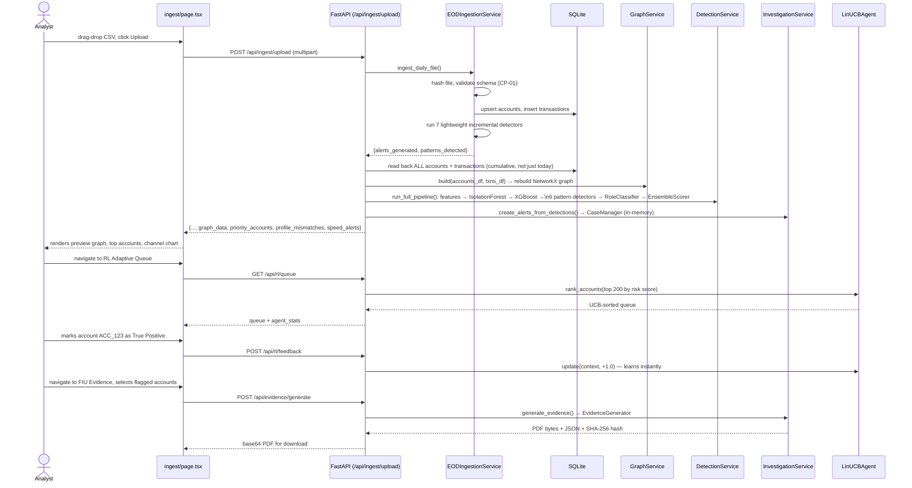
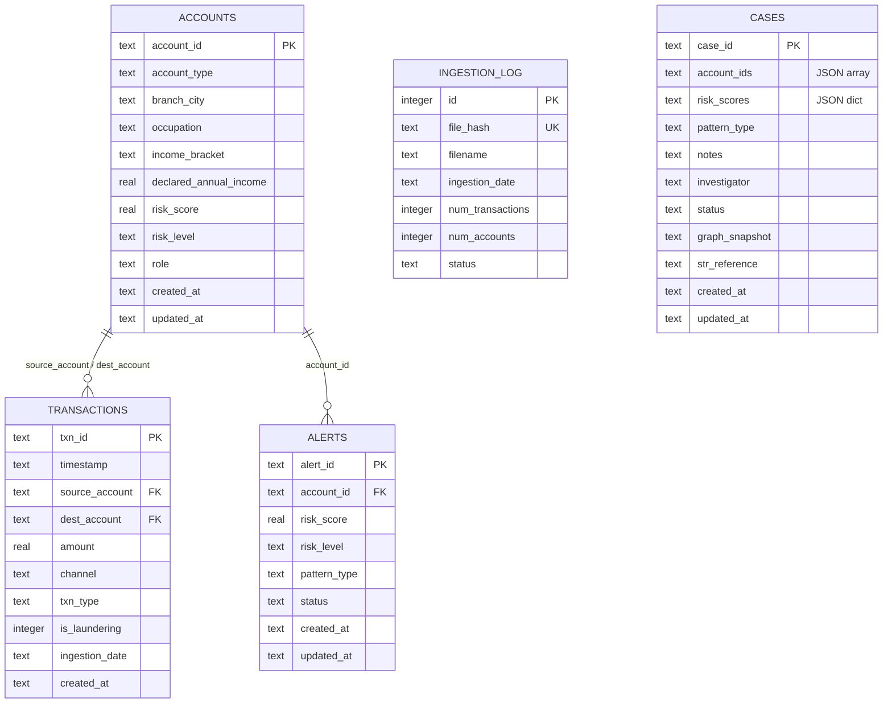

# TraceX — Complete System Explanation (0 → 100)

*A from-scratch technical reference to the TraceX AML Intelligence System, written for an engineer who has never seen this codebase before. Every claim below is traceable to a real file/function in `fund-flow-tracker/`. Where the code diverges from the README or from the pitch docs, that's called out explicitly rather than smoothed over.*

## Table of Contents
1. [Executive Summary](#1-executive-summary)
2. [Core Concepts Glossary](#2-core-concepts-glossary-for-a-new-engineer)
3. [Business Context & Regulatory Framing](#3-business-context--regulatory-framing)
4. [High-Level Design (HLD)](#4-high-level-design-hld)
5. [Low-Level Design (LLD) per Layer](#5-low-level-design-lld-per-layer)
6. [End-to-End Data Flow Trace](#6-end-to-end-data-flow-trace)
7. [Database Schema](#7-database-schema)
8. [API Reference Walkthrough](#8-api-reference-walkthrough)
9. [Frontend Architecture](#9-frontend-architecture)
10. [Tech Stack Table with Reasoning](#10-tech-stack-table-with-reasoning)
11. [Operations Guide](#11-operations-guide)
12. [Known Gaps & Improvement Roadmap](#12-known-gaps--improvement-roadmap)
13. [Cheat Sheet — "What to Say If Asked"](#13-cheat-sheet--what-to-say-if-asked)

---

## 1. Executive Summary

TraceX is an **Anti-Money Laundering (AML) intelligence system** built for a hackathon targeting Union Bank of India. It takes a raw CSV of bank transactions, builds a live graph of who-paid-whom, runs six independent fraud-pattern detectors plus a two-model ML pipeline over that graph, produces a single 0–100 risk score per account, and gives a human investigator everything needed to open a case and file a regulatory **Suspicious Transaction Report (STR)** — all through a FastAPI backend and a Next.js dashboard.

The user of this system is a **bank compliance/AML analyst**, not a customer. Their job today is manual and slow: scan spreadsheets, follow up individual transactions, decide who to investigate. TraceX's job is to do the first 90% of that triage automatically and explain *why* each account is suspicious in plain English (via an LLM), so the analyst spends their time on judgment calls, not data wrangling.

The most distinctive engineering choice in the codebase is a **LinUCB contextual bandit** (`services/rl/bandit.py`) that re-ranks the investigation queue and *learns* from every investigator's true-positive/false-positive verdict — a genuinely novel idea for this space, discussed in depth in [§5.5](#55-rl-layer--adaptive-investigation-queue-serviceslr).

---

## 2. Core Concepts Glossary (for a new engineer)

Read this section once; everything below assumes it.

**Software/infra terms**
- **FastAPI**: a Python web framework for building REST APIs. It auto-generates OpenAPI docs and validates request bodies against Pydantic models (see below). TraceX's entire backend is one FastAPI app (`api/server.py`, 2538 lines, ~60 routes).
- **REST API**: a way for the frontend (browser) to talk to the backend over HTTP — `GET /api/accounts` fetches data, `POST /api/rl/feedback` submits data. Every button click in the Next.js app ultimately calls one of these.
- **Pydantic model**: a Python class that both validates incoming JSON (rejects malformed requests) and documents the expected shape of a request/response.
- **SSE (Server-Sent Events)**: a one-way streaming protocol — the server keeps a connection open and pushes events to the browser as they happen. TraceX uses it for the "Real-Time Detection Demo" (`/api/realtime/stream`) because the flow is purely server→client (alerts arriving), unlike WebSockets which are bidirectional and would be overkill here.
- **ORM vs raw SQL**: TraceX uses **raw SQL via `sqlite3`**, not an ORM (SQLAlchemy etc.) — see `infrastructure/database.py`. This is a deliberate simplicity choice for a demo-scoped system, at the cost of manual query maintenance.
- **NetworkX / graph**: NetworkX is a Python library for representing and analyzing graphs (networks of nodes and edges) in memory. In TraceX, **every bank account is a node** and **every transaction is a directed edge** (source_account → dest_account). This is the single most important modeling decision in the system — money laundering is fundamentally a *network* crime (funds hopping between accounts), so representing it as a graph, rather than a flat table of rows, is what lets TraceX find multi-hop chains and cycles that a spreadsheet-style analysis would miss entirely.
- **MultiDiGraph**: a *directed* graph (edges have direction: A→B ≠ B→A) that also allows *multiple* edges between the same two nodes (because two accounts can transact more than once). NetworkX's `MultiDiGraph` is exactly this.
- **PageRank**: originally Google's algorithm for ranking web pages by how many (and how important) other pages link to them. Applied to a transaction graph, it approximates "how much money-weighted importance flows into this account" — a proxy for a hub/collector role.
- **Betweenness centrality**: a measure of how often a node sits *on the path* between other pairs of nodes. High betweenness = this account bridges many other accounts, which is exactly the profile of a money-mule intermediary.
- **Ego-network / ego-graph**: the local neighborhood of a single node — that node plus its direct (and sometimes 2-hop) connections. Used for the "zoom in on this one suspicious account" view.
- **Random walk (with restart)**: a way to explore a graph by taking random steps from a starting node, occasionally "teleporting" back to the start. Nodes visited more often are more strongly connected to the start node — TraceX uses this to surface likely accomplices of a flagged account (`/api/graph/random-walk`).
- **Isolation Forest**: an **unsupervised** anomaly-detection ML model. It doesn't need labeled fraud/not-fraud data — it isolates outliers by randomly partitioning the feature space, on the theory that anomalies are easier to isolate (need fewer splits) than normal points. Used here because most real AML data has very few *confirmed* fraud labels.
- **XGBoost**: a **supervised**, gradient-boosted decision tree classifier. Unlike Isolation Forest, it needs labeled data (`is_laundering` column) and learns to directly predict "is this a fraud account." It's the industry-standard choice for structured/tabular data like transaction features.
- **Ensemble scoring**: combining multiple independent signals (ML models + rule-based pattern detectors + graph centrality) into one composite score, on the principle that agreement across independent systems is stronger evidence than any single system alone — the same way an experienced investigator weighs multiple clues.
- **Contextual bandit / multi-armed bandit / RL**: a class of algorithms that decide, at each step, "which option should I try given what I know about the current context?", and update their beliefs based on the reward received. **Exploration vs. exploitation** is the central tension: exploit = keep recommending what's worked before; explore = occasionally try something uncertain because it *might* work even better. TraceX's bandit (LinUCB) explicitly balances these — see [§5.5](#55-rl-layer--adaptive-investigation-queue-serviceslr).
- **Event bus / pub-sub**: a pattern where a service *publishes* events to named "topics" without knowing who (if anyone) is listening, and other services *subscribe* to topics they care about. This decouples producers from consumers. TraceX's `infrastructure/event_bus.py` is an in-process, single-machine version of this pattern, explicitly designed to be a drop-in stand-in for Kafka.
- **CI/CD**: automated build/test pipelines that run on every code push (see `.github/`).
- **k8s (Kubernetes)**: container orchestration for running many copies of a service, auto-scaling them, and restarting failed ones. TraceX has a k8s manifest (`k8s/api-deployment.yaml`) that describes an *aspirational* production deployment — see [§11](#11-operations-guide) and [§12](#12-known-gaps--improvement-roadmap) for how much of this is actually wired up versus aspirational.

**AML domain terms**
- **KYC (Know Your Customer)**: the bank's process of verifying a customer's identity and profile (occupation, income, etc.) when opening an account. TraceX compares a customer's *declared* profile (KYC data) against their *actual* transaction behavior to find mismatches.
- **Structuring / Smurfing**: deliberately breaking a large sum into multiple smaller transactions, each just under a reporting threshold (₹10 lakh in India), specifically to dodge mandatory reporting.
- **Layering**: moving funds through a chain of intermediate accounts (A→B→C→D...) in quick succession so the money's origin becomes hard to trace. Each hop "launders" a bit more of the trail.
- **Round-tripping / circular transactions**: money that eventually flows back to (or near) its origin account through a loop of intermediaries — often used to fabricate the appearance of legitimate business activity.
- **Mule account**: an account (often belonging to an unwitting or complicit third party) used purely to receive and immediately forward funds, obscuring the real controller of the money.
- **Dormancy reactivation**: a long-inactive account that suddenly bursts into high-value activity — a classic sign of an account being "acquired" (bought, stolen, or coerced) for laundering.
- **CTR (Currency Transaction Report)**: in India, banks must report cash transactions above a threshold (used here as ₹10 lakh, `ctr_threshold` in `infrastructure/config.py`) to the regulator.
- **STR (Suspicious Transaction Report)**: a mandatory filing to India's **FIU-IND (Financial Intelligence Unit – India)** under the **PMLA (Prevention of Money Laundering Act)** whenever a bank suspects laundering, regardless of amount. Banks must file within 7 days of forming suspicion. TraceX's "Evidence" page generates a draft STR PDF + JSON pack for this purpose.
- **P1–P4 priority**: TraceX's own investigation-triage labels (Critical/High/Medium/Low), not a regulatory term — see `EnsembleScorer.compute_priority()` in `services/detection/ensemble.py:477`.

---

## 3. Business Context & Regulatory Framing

Today, AML compliance teams at Indian banks work largely from **rule-based transaction monitoring systems** (e.g., threshold alerts: "flag any single transaction over ₹10L") plus manual analyst review. This has two well-known failure modes that TraceX is explicitly designed around:

1. **Multi-hop schemes are invisible to single-transaction rules.** A launderer who moves ₹9L through 5 accounts in an hour never trips a single-transaction ₹10L rule, but *is* visible the instant you look at the transaction graph as a whole (a 5-hop chain in under an hour is exactly what `LayeringDetector` looks for).
2. **Analyst time is the bottleneck, not detection.** Even when a system flags 10,000 accounts, a human still has to manually decide which to look at first, then dig up the supporting evidence to justify an STR filing. TraceX collapses this into: a risk score, a plain-English "why flagged" explanation, a one-click evidence pack, and (uniquely) a queue that gets smarter every time an investigator marks something true/false positive.

Every one of the 6 detectors maps to a named typology recognized by FATF (Financial Action Task Force) guidance and RBI AML circulars — this is deliberate, since an investigator needs to cite *which typology* justified an STR filing, not just "the model said so." The STR evidence pack (`services/investigation/evidence.py`) explicitly generates FIU-IND-formatted PDF/JSON output with a SHA-256 hash for tamper-evidence, because a regulator-facing document needs an audit trail.

The `docs/BUSINESS_CASE.md` file quantifies a claimed ₹17 Cr/year value from reduced investigator headcount and improved STR on-time filing — these are **hackathon-pitch estimates**, not measured production numbers; treat them as illustrative, not verified.

---

## 4. High-Level Design (HLD)



**Walkthrough:** The frontend never talks to the database or the graph engine directly — everything goes through the FastAPI layer, which holds the *only* copies of the live graph and detection results in a module-level Python dict called `_state` (`api/server.py:101`) plus singleton service instances (`api/server.py:79-84`). This means **the whole analytical pipeline (graph + ML + detectors) is rebuilt in memory on every `/api/init`, `/api/refresh`, or `/api/upload` call** — there is no persistent "graph service" running independently; the graph lives only as long as the Python process does. SQLite is used for durable storage of accounts/transactions/alerts/cases, while the *live* analytical state (risk scores, detection results, the NetworkX graph object itself) is transient, in-process memory. This is a deliberate and important architectural fact: restart the API process and you lose all computed risk scores until you POST `/api/refresh` again (which rebuilds everything from the DB).

---

## 5. Low-Level Design (LLD) per Layer

### 5.1 Ingestion Layer (`services/ingestion/`)

**Two parallel ingestion code paths exist** — this is a real architectural quirk, not a documentation error:

1. **Bulk/demo path** — `IngestionService` (`services/ingestion/service.py`) + `parsers.py`. Used by `/api/init`, `/api/upload`, `/api/refresh`. Parses an entire CSV (IBM AML / PaySim / generic CSV) into `(accounts_df, transactions_df)` pandas DataFrames in one shot, synthesizes account metadata (occupation, income, branch) since the datasets don't include it (`_build_accounts()` in `parsers.py:239`), and hands off to `GraphService.build()` + `DetectionService.run_full_pipeline()`.
2. **Incremental/EOD path** — `EODIngestionService` (`services/ingestion/eod_service.py`, 906 lines). Used by `/api/ingest` and `/api/ingest/upload`. Designed to simulate a bank's real **end-of-day batch file** arriving daily: it hashes the file for idempotency (`compute_file_hash()`), persists rows to SQLite, and runs its **own separate, lighter-weight set of pattern checks** (`_detect_structuring`, `_detect_velocity_spikes`, `_detect_round_trips`, `_detect_fan_in`, `_detect_fan_out`, `_detect_profile_mismatch`, `_detect_mule_pattern` — all private methods on `EODIngestionService`, distinct implementations from the "real" detectors in `services/detection/`).



Data contracts are enforced at two points via `services/validation/contracts.py`'s `DataContractValidator`: once on raw transactions/accounts (schema, nulls, amount plausibility, self-transfer detection) and once on extracted ML features (NaN/Inf checks, constant-column detection). Violations feed `infrastructure/health.py`'s **CP-01 checkpoint** (schema validation pass rate) — this is one of 8 named "checkpoints" (CP-01 through CP-08) that `HealthMonitor` tracks to catch *silent* pipeline failures rather than loud crashes.

### 5.2 Graph Layer (`services/graph/`)

`TransactionGraph` (`services/graph/engine.py`) wraps a single `networkx.MultiDiGraph`. Key design choices, all commented directly in the code:

- **Minimal edge attributes** — only `amount` and `is_laundering` are stored per edge (not timestamp/channel), because storing those for millions of edges would cost gigabytes of RAM. Detectors that need timestamps read `transactions_df` directly instead of the graph object (`engine.py:39-42`).
- **Centrality is approximated, not exact.** `compute_centrality()` (`engine.py:80`) does **not** run NetworkX's real PageRank/betweenness algorithms (too slow on 500K+ node graphs). Instead: PageRank ≈ normalized weighted in-flow per account; betweenness ≈ normalized `in-degree × out-degree`. This is a deliberate, documented trade-off — fast pandas groupby aggregations instead of BFS-based graph algorithms — but it means the "PageRank" and "betweenness" shown in the UI are **proxies**, not the textbook algorithms.
- **Cycle detection** (`detect_cycles()`, `engine.py:207`) uses NetworkX's `simple_cycles` (an implementation of Johnson's algorithm) but bounds it heavily: restricts to strongly-connected components under 500 nodes, searches short cycles (length ≤3) first, then longer ones, capped at `max_cycles` — full unbounded cycle enumeration on a real transaction graph is computationally intractable.
- **Transaction chains** (`get_transaction_chains()`, `engine.py:250`) are the backbone of layering detection: a greedy temporal walk that, from each starting transaction, follows the *next* qualifying edge within a time window, building multi-hop chains.
- **`get_validation_subgraph()`** (`engine.py:350`) is a notably careful piece of code: it builds the ego-network shown in the "Graph Validation" dialog such that a **hub account's ego-network stays readable** — always show direct neighbors (capped to the highest-amount ones if there are hundreds), and only reach to 2-hop nodes if they're part of an *already-detected* cycle or chain (real evidence), never a blind BFS expansion. This directly fixes a UX problem where a mule/hub account would otherwise render an unreadable hairball.



### 5.3 Detection Layer (`services/detection/`)

The README advertises **"5 detectors"**; the code actually runs **6**: Layering, Round-Trip, Structuring, Dormancy, Profile Mismatch, and **Fan-Out/Fan-In** (`services/detection/fan_out.py`) — the last one covers 4 IBM-AML pattern types (FAN-OUT, FAN-IN, GATHER-SCATTER, BIPARTITE/SCATTER-GATHER) and is fully wired into `DetectionService.run_full_pipeline()` (`services/detection/service.py:167`) and the ensemble scorer's `pattern_weights` dict (`ensemble.py:397`). This is a real discrepancy between docs and code, not a hidden/unused feature.

| Detector | File | Method | Key threshold(s) |
|---|---|---|---|
| Layering | `layering.py` | Temporal chain extraction (tight + extended-window passes), amount-decay check | `layering_min_hops=3`, 120-min tight window OR 30-day extended window with ≥4 hops |
| Round-Trip | `round_trip.py` | Johnson's cycle detection + return-ratio check | `round_trip_amount_return_ratio=0.85`, cycle length ≤12 |
| Structuring | `structuring.py` | Hybrid: hard-rule (amounts in ₹9–9.99L band, ≥3 txns/30-day window) + daily-split detection | `ctr_threshold=₹10L`, `structuring_min_count=3` |
| Dormancy | `dormancy.py` | Vectorized max-gap detection + post-gap burst multiplier | `dormancy_threshold_days=180`, `dormancy_multiplier=10×` |
| Profile Mismatch | `profile.py` | 3 sub-checks: income-ratio > 10×, peer z-score > 3σ, rolling behavioral-shift z-score > 3 | `profile_mismatch_z_threshold=3.0` |
| Fan-Out/Fan-In | `fan_out.py` | Sliding-window unique-counterparty count (fan) + shared-sender bipartite clustering | `fan_out_min_degree=3`, 30-day window |

Each detector returns a list of `DetectionResult` dataclasses (`services/common/models.py:124`) — a `score` (0–1), `severity` (LOW/MEDIUM/HIGH/CRITICAL), a `details` dict, and human-readable `indicators` strings, so every flag is independently explainable without needing to inspect the graph.

**ML pipeline** (`services/detection/ensemble.py`):
- `AnomalyDetector` — scikit-learn `IsolationForest`, unsupervised, `contamination=0.05` (i.e. expects ~5% of accounts to be anomalous). Runs on all 27 engineered features (`FeatureExtractor._FEATURE_COLS`, `features.py:50`) with no need for labels.
- `FraudClassifier` — XGBoost, supervised, trained on `is_laundering` labels **from source accounts only** (a documented experiment: including destination accounts as positive labels dropped precision from 77.8% to 4.9%, `ensemble.py:279`). Uses a **temporal 70/15/15 train/val/test split** to avoid data leakage, GPU acceleration via CUDA when available (falls back to CPU silently), early stopping, and a PR-curve-optimized decision threshold (not the default 0.5) — current tuned config comments cite PR-AUC=0.64, Precision=0.778, Recall=0.609, F1=0.683 (`infrastructure/config.py:52-53`, from an experiment log, not live-verified in this session).
- `RoleClassifier` — a simple percentile-based rule (not ML): SOURCE (mostly outflow), SINK (mostly inflow), MULE (balanced in/out with ≥2 in/out degree), else NORMAL.
- `EnsembleScorer.compute_all()` (`ensemble.py:366`) — the actual risk-score formula, worth reading in full because it's more nuanced than "30/40/30":
  - **ML contribution**: gated on the XGBoost *binary* prediction (not raw probability) — this is a deliberately documented fix, because raw probabilities near the PR-curve threshold (often 0.9+) would otherwise inflate scores for accounts XGBoost correctly classifies as clean.
  - **Pattern contribution**: sum of per-pattern weights (round_trip=30, layering=25, fan_out/in=22, structuring=20, dormancy=20, profile_mismatch=15), capped at 100, then × 0.55.
  - **Graph contribution**: percentile-based PageRank/betweenness bonus, but **only applied if the account already has at least one pattern flag** — this prevents high-degree-but-clean accounts (e.g. a popular retail branch account) from being falsely elevated purely for being a hub.
  - **Convergence bonus**: up to +15 points when pattern detectors *and* XGBoost (prob > 0.5) agree — rewarding corroboration between independent systems, mirroring how a senior investigator would weigh multiple agreeing signals more heavily than one.
- **`compute_priority()`** (`ensemble.py:477`) turns (risk score, confidence level, transaction amount, account count) into the P1–P4 label the frontend displays.

### 5.4 Investigation & Case Management Layer (`services/investigation/`)

There are **two separate case-tracking systems** in this codebase, and they are not the same data:
1. **`CaseManager`** (`services/investigation/case_manager.py`) — a pure in-memory dataclass store (`Alert`, `Case` from `services/common/models.py`). Auto-creates up to 500 alerts from the top-scoring detections on every pipeline run (`auto_create_alerts_from_detections()`), wiping and rebuilding on each refresh. This backs `GET /api/alerts`.
2. **SQLite `cases` table** (`infrastructure/database.py:210`) — a separately, manually created case via `POST /api/cases` from the Evidence page, persisted durably with a status workflow (`open` → `in_progress`/`escalated`/`closed`). This backs `GET/POST /api/cases`.

These do not reference each other — an analyst-created case in the Evidence UI has no link back to the auto-generated in-memory `Alert` objects. This is a real architectural inconsistency (see [§12](#12-known-gaps--improvement-roadmap)).

**Evidence generation** (`services/investigation/evidence.py`) assembles account details + relevant transactions + detection summary into a dict, serializes to JSON, SHA-256-hashes it (`json_hash`, checked against `CP-08:EvidenceIntegrity` in `health.py:140`), and renders a PDF via `fpdf2` formatted as a 4-part STR: Reporting Entity → Subject Accounts → Transaction Summary → Reason for Suspicion, mapped to the 13 `SUSPICION_CATEGORIES` in `services/common/constants.py:94` (FIU-IND's own category list).

### 5.5 RL Layer — Adaptive Investigation Queue (`services/rl/`)

This is the newest and most novel component (just merged — see git log `feat: graph validation dialog, real-time detection page, live dashboard panel` and the recent RL bandit commit). It replaces (or rather, *augments alongside*) the static P1–P4 formula with a learned ranking.

**Algorithm: LinUCB (Linear Upper Confidence Bound)** — a well-known contextual bandit algorithm (Li et al., WWW 2010, originally for news article recommendation; the docstring in `bandit.py:21` cites this directly).

- **Context (state)**: a 16-dimensional feature vector per account — `build_context()` (`bandit.py:113`) — including normalized risk score, anomaly score, fraud probability, pattern-count, one-hot flags for each of the 5 named patterns, SOURCE/MULE role flags, log-scaled total amount, normalized counterparty count, income-to-volume ratio, channel diversity, and a bias term.
- **Action**: implicitly, "recommend investigating this account next" (the queue ranking itself).
- **Reward**: **+1.0** if an investigator confirms True Positive, **−0.3** if False Positive, via `POST /api/rl/feedback`.
- **Math**: maintains a `d×d` precision matrix `A` (initialized to identity) and reward vector `b` (`bandit.py:49-50`). Ridge-regression-style closed form: `theta = A⁻¹b` gives the learned linear weights; `expected = theta·x`; `uncertainty = sqrt(xᵀA⁻¹x)`; final ranking score `UCB = expected + α·uncertainty` (`score()`, `bandit.py:60`). The **uncertainty term is what drives exploration** — accounts the agent hasn't seen enough similar examples of get a UCB boost even if their expected reward is moderate, which is why the UI marks some rows `(EXPL)`.
- **Update**: every feedback event does `A += xxᵀ; b += reward·x` — an O(d²) matrix update, sub-millisecond even with hundreds of features, which is *why* this was chosen over deep RL (no GPU, no training loop, works from the very first feedback event — no cold-start problem).
- **Interpretability**: `get_learned_weights()` (`bandit.py:141`) exposes θ directly per feature name — a compliance-friendly property, since a black-box deep RL policy would be very hard to justify to a regulator, whereas "the agent learned that `has_layering` is a strong positive predictor and `has_structuring` alone is a weak one for this bank's data" is auditable.
- **Persistence**: state (`A`, `b`, counters) is serialized to `data/rl_state.json` on every update (`bandit.py:181`) and reloaded on process restart — this is the *only* piece of analytical state in the whole system that survives a server restart; risk scores and the graph do not.
- **Demo scaffolding**: `POST /api/rl/simulate` replays scripted synthetic feedback sequences (`_RL_SCENARIOS` in `api/server.py:2490`) so a judge/demo audience can watch the learned weights evolve in seconds without needing real investigator history.



### 5.6 Real-Time Layer (`services/realtime/`)

`RealtimeStreamService` (`stream_service.py`) is a **scripted demo**, not a production streaming pipeline: it replays a small fixed CSV (`data/tracex_realtime_demo.csv`) one row at a time with a 1.2s delay, but — importantly — each row genuinely runs through `EODIngestionService.ingest_transaction_rows()` (the real incremental detection path), so the alerts shown are live-computed, not canned. Events are published to the `EventBus` on three topics (`realtime.transaction`, `realtime.alert`, `realtime.done`) and relayed to the browser over SSE (`GET /api/realtime/stream`, `api/server.py:2088`). Each run self-resets any leftover `RTD`-prefixed demo data first so repeated demo runs are deterministic.

### 5.7 API / Presentation Layer

`api/server.py` is intentionally a thin routing layer — the module docstring states explicitly "All business logic lives in services/. This layer only handles: HTTP routing, CORS, health endpoints." In practice, this boundary is **not perfectly held** — a meaningful amount of aggregation/formatting logic (e.g. the entire upload-summary block at `api/server.py:1901-2034`, or the RL feature-building helpers at `api/server.py:2362-2418`) lives directly in the API layer rather than in a service. This is a common and reasonable trade-off under hackathon time pressure, but worth knowing if you're hunting for "where does X get computed."

---

## 6. End-to-End Data Flow Trace

Concrete example: an analyst uploads a CSV of the day's transactions via the Ingest page.



Note the architecturally significant detail in the middle: **every ingestion event re-runs the full detection pipeline over the entire cumulative dataset**, not an incremental delta — the "EOD incremental" detectors in `eod_service.py` run first for fast same-day alerting, but the full graph/ML/6-detector pipeline still rebuilds from scratch on every upload. This is fine at demo scale (thousands of rows) and would become a real bottleneck at bank scale (millions of daily rows) — flagged again in [§12](#12-known-gaps--improvement-roadmap).

---

## 7. Database Schema

SQLite is the default backend (`infrastructure/database.py:31`); a parallel `Neo4jAdapter` class implements the identical interface and is selected automatically if `DB_BACKEND=neo4j` and `NEO4J_URI` are set, falling back to SQLite on connection failure. **In practice, only the SQLite path is exercised by this deployment** (see §11 for what's actually running).



Indexes exist on `transactions(source_account, dest_account, timestamp, ingestion_date)`, `alerts(account_id, risk_level, status)`, `accounts(risk_score, risk_level)`, and `cases(status, created_at)` — reasonable for the query patterns actually used (`database.py:200-225`).

Note: `alerts` (the SQLite table) is written via `upsert_alert()`/`get_alerts()` methods that exist on `DatabaseAdapter` but are **not actually called anywhere in `api/server.py`** — `GET /api/alerts` reads from the in-memory `CaseManager` instead (`api/server.py:1120-1122`). The SQLite `alerts` table appears to be effectively dead/unused in the current code path.

---

## 8. API Reference Walkthrough

`api/server.py` exposes roughly 60 routes. Grouped by concern, with the backing service and consuming frontend page:

| Group | Key routes | Backing service | Frontend consumer |
|---|---|---|---|
| Health | `/health`, `/health/live`, `/health/ready`, `/api/health` | `infrastructure/health.py` | (used by k8s probes / manual checks) |
| System init | `POST /api/init`, `/api/refresh`, `/api/upload` | Ingestion+Graph+Detection+Investigation, chained | `ingest/page.tsx` |
| Dashboard | `/api/overview`, `/api/dashboard/live` | `DetectionService`, `GraphService` | `page.tsx` (Dashboard) |
| Accounts | `/api/accounts`, `/api/accounts/{id}`, `/api/explain/account/{id}` | `DetectionService` + OpenRouter | multiple pages |
| Graph | `/api/graph`, `/graph/ego/{id}`, `/graph/fund-trail`, `/graph/random-walk`, `/graph/pattern/{type}`, `/graph/validate/{id}`, `/graph/filtered` | `GraphService` / `TransactionGraph` | `graph/page.tsx`, `GraphValidationDialog.tsx` |
| Detections/Patterns | `/api/detections`, `/api/patterns`, `/api/patterns/first-suspicious/{id}`, `/api/model-metrics` | `DetectionService` | `patterns/page.tsx`, `anomaly/page.tsx` |
| Anomaly/ML queue | `/api/anomaly` | `DetectionService.ensemble` | `anomaly/page.tsx` |
| Profile | `/api/profile`, `/api/profile/{id}` | direct pandas aggregation in `server.py` | `profile/page.tsx` |
| Channels | `/api/channels` | direct pandas aggregation in `server.py` | `channels/page.tsx` |
| Cases | `/api/cases` (GET/POST), `/api/cases/{id}`, `/api/cases/{id}/status` | SQLite directly via `get_database()` | `evidence/page.tsx` |
| Evidence | `/api/evidence`, `/api/evidence/generate` | `InvestigationService.generate_evidence` | `evidence/page.tsx` |
| Alerts | `/api/alerts` | in-memory `CaseManager` | (not surfaced in current sidebar) |
| RL queue | `/api/rl/queue`, `/api/rl/feedback`, `/api/rl/weights`, `/api/rl/simulate` | `LinUCBAgent` | `rl-queue/page.tsx` |
| EOD/DB ingestion | `/api/ingest`, `/api/ingest/upload`, `/api/ingest/status`, `/api/ingest/history` | `EODIngestionService` | `ingest/page.tsx` |
| Real-time demo | `/api/realtime/start`, `/status`, `/stream` (SSE) | `RealtimeStreamService` | `realtime/page.tsx` |
| Transactions | `/api/transactions`, `/api/transactions/filtered` | direct pandas slicing | `graph/page.tsx`, others |
| Observability | `/api/bus/stats`, `/api/bus/dlq`, `/api/metrics`, `/api/db/stats` | `EventBus`, `monitor` | (mostly unused by current UI) |
| Explanations | `/api/explain/metric/{name}`, `/api/explain/metrics` | static `METRIC_EXPLANATIONS` dict | `InfoTooltip` component, used across pages |

All routes are gated by `_require_ready()` (`api/server.py:141`), which 503s if `graph_svc.is_ready` is false — i.e. before the first successful `/api/init`/`/api/refresh`/`/api/upload`.

---

## 9. Frontend Architecture

Next.js 16 App Router, React 19, TypeScript, Tailwind v4, `next dev --webpack` (not Turbopack). No global state library (Redux/Zustand/etc.) — every page is a `"use client"` component managing its own `useState`/`useEffect` data fetching directly against `frontend/src/lib/api.ts`, a single typed fetch wrapper (`fetchApi<T>()`) with one `api.*` function per backend route and matching TypeScript interfaces mirroring the Python response shapes.

| Page (`app/*/page.tsx`) | Purpose | Key API calls |
|---|---|---|
| `page.tsx` (Dashboard) | Overview stats, risk distribution, top alerts, live activity | `getOverview`, `getDashboardLive` |
| `ingest/page.tsx` | CSV upload, ingestion history, upload preview/summary | `ingestUpload`, `getIngestionHistory`, `getIngestionStatus` |
| `graph/page.tsx` (1163 lines — largest page) | Interactive graph explorer: full network / ego / pattern-subgraph views, fund trail, accomplice search | `getGraph`, `getEgoGraph`, `getFundTrail`, `getRandomWalk`, `getPatternGraph` |
| `anomaly/page.tsx` | ML anomaly scores, investigation queue, speed alerts | `getAnomaly` |
| `rl-queue/page.tsx` | RL-ranked queue, TP/FP feedback buttons, learned-weights bar chart, scenario simulator | `getRLQueue`, `submitRLFeedback`, `simulateRL` |
| `patterns/page.tsx` | Tabbed view per detector type, first-suspicious-transaction search, Graph Validation dialog trigger | `getPatterns`, `getFirstSuspicious`, `getGraphValidation` (via dialog) |
| `profile/page.tsx` | Income-vs-volume scatter, peer group z-score lookup | `getProfile`, `getPeerGroup` |
| `channels/page.tsx` | Channel usage summary, Sankey-style flow data, heatmap, suspicious-channel table | `getChannels` |
| `evidence/page.tsx` | Case creation, account selection, STR PDF/JSON generation | `getAccounts`, `generateEvidence`, `getCases` |
| `realtime/page.tsx` | Live SSE-driven transaction/alert feed with animated graph | raw `EventSource` to `/api/realtime/stream`, `startRealtimeDemo` |

Shared components: `CytoscapeGraph.tsx` (572 lines) wraps `cytoscape.js` for the interactive network visualizations (nodes colored by risk level, sized by degree); `GraphValidationDialog.tsx` renders the "prove this isn't hardcoded" modal backed by `/api/graph/validate/{id}`; `ui.tsx` holds shared primitives (`Card`, `StatCard`, `Loader`, `Badge`, `InfoTooltip` — the latter powers the ⓘ tooltips wired to `/api/explain/metric/{name}`); `Sidebar.tsx` is the top nav bar (not actually a sidebar despite the name — it's a fixed horizontal header).

A recurring UI pattern worth noting: nearly every page implements its own local `AIExplanation`-style component that calls `getAccountExplanation()` — this is duplicated (copy-pasted with minor variations) across `graph/page.tsx`, `ingest/page.tsx`, `profile/page.tsx`, `anomaly/page.tsx` rather than extracted into a shared component.

---

## 10. Tech Stack Table with Reasoning

| Layer | Technology | Why it was likely chosen | Hackathon-appropriate vs. production-grade |
|---|---|---|---|
| Backend framework | FastAPI | Async support, automatic OpenAPI docs, Pydantic request validation, minimal boilerplate — fast to build a 60-route API solo | Reasonable for either scale; would add auth middleware + structured logging for production |
| Frontend framework | Next.js 16 (App Router) + React 19 | Modern, batteries-included React framework; file-based routing matches the multi-tab dashboard shape well | Fine as-is; Turbopack is available but the project pins `--webpack`, likely for compatibility with `cytoscape`/canvas-heavy components |
| Graph engine | NetworkX (`MultiDiGraph`) | Zero-infrastructure, pure-Python graph library — perfect for rapid iteration on graph algorithms without standing up Neo4j | **Hackathon-appropriate, not production-grade.** In-memory only, single-process, doesn't survive restarts, won't scale past a few million edges. The code explicitly documents "In production, swap NetworkX for Neo4j via CDC" (`engine.py:5`) and a `Neo4jAdapter` already exists as a parallel implementation for the *storage* layer (though the *graph algorithms* still assume NetworkX) |
| Database | SQLite (with a parallel unused-in-practice Neo4j adapter) | Zero-setup persistence, perfect for a single-demo-machine deployment; `DatabaseAdapter` abstraction anticipates swapping backends later | Not production-grade for concurrent writes/multi-instance deployment — WAL mode helps single-writer concurrency but SQLite fundamentally isn't built for horizontally-scaled API pods |
| Unsupervised ML | scikit-learn `IsolationForest` | Doesn't require fraud labels — critical because real AML datasets have very few confirmed-fraud rows | Standard choice for this exact problem shape |
| Supervised ML | XGBoost (GPU via CUDA when available) | Best-in-class for structured/tabular data; gradient boosting on engineered graph+behavioral features; GPU support turns a multi-minute CPU job into seconds | Reasonable at both scales; GPU detection gracefully falls back to CPU (`ensemble.py:35`) |
| Adaptive ranking | Custom LinUCB implementation (pure NumPy) | No framework/GPU dependency, works from the first feedback event (no cold start), fully interpretable weight vector — all explicitly valuable in a regulated, auditable domain (documented reasoning in `RL_USP.md`) | Legitimate production-quality algorithmic choice, though the persistence (`data/rl_state.json`) and single-process assumption would need a real store (Redis/DB) to survive multi-instance deployment |
| LLM explanations | OpenRouter (model-agnostic proxy, default `openai/gpt-4o-mini`) | Avoids hard-coupling to one LLM vendor; cheap, fast model sufficient for templated 3-4 sentence prose | Fine either way; API key handling via `.env` is basic but adequate for a demo |
| Streaming | Server-Sent Events (not WebSockets) | The real-time demo is purely server→client push (alert firing), no client→server messages needed mid-stream — SSE is simpler and sufficient | Appropriate choice for the use case |
| Event bus | Custom in-process pub/sub (`infrastructure/event_bus.py`) | Explicitly designed to mirror Kafka semantics (topics, offsets, dead-letter queue) so it can be swapped for `confluent-kafka-python` later with "zero service code changes" per its own docstring | Good abstraction design, but today it's single-process — events don't survive a restart and can't be consumed by a second process |
| Graph visualization | Cytoscape.js (via `react`) | Purpose-built for network/graph rendering with layout algorithms, better suited than generic charting libs for the node/edge interactivity needed here | Appropriate |
| PDF generation | `fpdf2` | Lightweight, no headless-browser dependency, sufficient for a structured text+table STR report | Appropriate for this document shape |
| Container/orchestration | Docker + a single `k8s/api-deployment.yaml` (Deployment, Service, HPA, PDB, Ingress) | Demonstrates production-readiness intent | **Largely aspirational** — see §12; references `NEO4J_URI`, `JWT_SECRET`, and a `tracex-frontend` service that don't have matching wired-up counterparts in the running code |

---

## 11. Operations Guide

**Local run** (confirmed working in this session):
```bash
cd fund-flow-tracker
python -m venv venv && source venv/bin/activate
pip install -r requirements.txt
uvicorn api.server:app --host 0.0.0.0 --port 8000

# separate terminal — requires Node ≥20.9 (Next.js 16 requirement; Node 18 will fail at startup)
cd fund-flow-tracker/frontend
npm install
npm run dev   # http://localhost:3000
```
On first boot, POST `/api/init` (or use the Ingest page with `data/tracex_test_day1.csv`, which ships in the repo with 8,000 transactions / 312 accounts) before any other endpoint will return real data — everything 503s via `_require_ready()` until the graph is built at least once.

**Health endpoints**: `/health` returns the full `HealthMonitor` report (per-service status, all 8 named checkpoints, event counters); `/health/live` is a trivial liveness ping; `/health/ready` reflects `graph_svc.is_ready` — these three map directly onto k8s `livenessProbe`/`readinessProbe` conventions, and the k8s manifest does wire them up correctly.

**Configuration**: all tunable thresholds live in one place, `infrastructure/config.py` — a dataclass-based `SystemConfig` singleton (detection thresholds, graph parameters, health check intervals). `.env` (not committed) supplies `OPENROUTER_API_KEY`/`OPENROUTER_MODEL` for AI explanations (optional — the system explicitly degrades to a static "AI explanations not configured" message without it) and, for the unused Neo4j path, `NEO4J_URI`/`NEO4J_USER`/`NEO4J_PASSWORD`.

**Docker**: `Dockerfile` (backend) is a straightforward `python:3.11-slim` + `pip install` + `uvicorn` image; `frontend/Dockerfile` is a proper multi-stage Next.js build. **Neither has been verified running in this session** — no `docker-compose.yml` exists to run both together, so there's no single documented command for a full containerized local stack.

**Kubernetes**: `k8s/api-deployment.yaml` describes a 3-replica Deployment with an HPA (3–20 pods on CPU/memory), a PodDisruptionBudget, anti-affinity, non-root security context, and an Ingress routing `/api` to `tracex-api` and `/` to a `tracex-frontend` service. **This manifest references infrastructure that doesn't fully exist elsewhere in the repo** — there's no `tracex-frontend` k8s manifest, no `tracex-secrets` Secret definition, and (per §12) the `JWT_SECRET`-gated auth it expects is never actually invoked by `api/server.py`. Treat this file as a *design sketch* of the intended production topology, not a deploy-and-go artifact.

**Logging/monitoring**: `logging.basicConfig` is configured first thing in `api/server.py` so every service's `logger.info(...)` calls stream to stdout with timestamps — this is how the very verbose, emoji-annotated pipeline progress logs (`🚀 DETECTION PIPELINE STARTING`, `└─ STEP 6/6: ✅ ...`) get produced; useful for demo narration, less so for structured log aggregation. `services/monitoring/monitor` (referenced in `detection/service.py` and exposed at `/api/metrics`) tracks training runs and data-quality counts, but there's no Prometheus/Grafana wiring despite `docs/SCALABILITY.md` sketching one.

---

## 12. Known Gaps & Improvement Roadmap

Organized by concern; each entry: current state → why it matters → what a production fix looks like. Synthesized from direct code reading in this session plus `docs/EVALUATION_IMPROVEMENT_PLAN.md`, `docs/SCALABILITY.md`, and `docs/SECURITY.md`.

### Security
- **Current state**: `infrastructure/security.py` implements JWT auth, RBAC (4 roles), rate limiting, and audit logging — but **it is never imported or invoked in `api/server.py`** (confirmed by grep in this session: zero references). Every one of the ~60 API routes is completely unauthenticated. CORS is hardcoded to `localhost:3000`/`127.0.0.1:3000` only (`api/server.py:70-76`).
- **Why it matters**: For an AML system handling account-level financial data and regulator-facing evidence, unauthenticated endpoints are a non-starter outside a local demo. `docs/EVALUATION_IMPROVEMENT_PLAN.md` itself flags this as the single "🔴 Critical" gap.
- **Production fix**: Actually wire `Depends(get_current_user)` and `Depends(check_rate_limit)` into routes (the plan doc even shows the exact code to add); move `JWT_SECRET` out of a hardcoded default (`security.py:38` ships a placeholder string); restrict CORS to real deployed origins.

### ML / Detection Accuracy
- **Current state**: XGBoost recall is documented at ~0.61 (F1=0.683) — meaning it misses roughly 4 in 10 real fraud accounts on its own; the ensemble compensates by weighting rule-based pattern flags more heavily (0.55×) specifically because of this known recall gap (commented directly in `ensemble.py:421-422`).
- **Why it matters**: In a regulated context, missed true positives (false negatives) are the costlier failure mode than false positives, since a missed STR filing carries compliance risk.
- **Production fix**: More labeled data (the IBM AML dataset's labels are synthetic-scenario, not real investigated cases); consider a two-stage model (higher-recall stage 1 filter, higher-precision stage 2 classifier); track precision/recall drift over time in production, not just at training time.
- **Explainability module is unused**: `services/detection/explainability.py` implements full SHAP-based local/global explanations (`ModelExplainer`, ~180 lines) and is listed in `requirements.txt`'s intent — but `shap` isn't even in `requirements.txt`, so it silently no-ops (`SHAP_AVAILABLE = False`), and it's **never called from `api/server.py`** — the actual "why flagged" feature (`/api/explain/account/{id}`) is a hand-built LLM prompt over summary statistics, not SHAP values. If genuine model-internal explainability is a goal, this module needs `pip install shap` and an actual call site.

### Architecture / Engineering Quality
- **Full-pipeline recompute on every ingest**: as shown in §6, every upload (even a small incremental daily file) triggers a full graph rebuild + all 6 detectors + IsolationForest + XGBoost retraining over the **entire cumulative dataset**, not just new rows. At current demo scale (thousands of rows) this is fine; at real bank scale (millions of transactions/day) this would take the pipeline from seconds to potentially hours per ingestion, and would need genuine incremental/streaming detection (the `EODIngestionService`'s lighter incremental detectors are a partial step toward this, but they're a second, separate, less rigorous detection implementation rather than an incremental mode of the main one).
- **Two disconnected case-tracking systems** (§5.4): in-memory `CaseManager`/`Alert` vs. SQLite `cases` table. An analyst-created case has no link to the system-generated alert that prompted it.
- **Dead/unused SQLite `alerts` table**: `DatabaseAdapter.upsert_alert()`/`get_alerts()` exist but nothing in `api/server.py` calls them; `/api/alerts` reads the in-memory store instead.
- **In-memory-only analytical state**: the graph, risk scores, detection results, and features all live only in the `DetectionService`/`GraphService`/`_state` singletons inside one Python process. A crash or redeploy loses all of it until `/api/refresh` is called again. The k8s manifest's 3-replica HPA setup would actually make this *worse* in a naive rollout — each pod would hold a different, independently-built copy of "the truth" with no shared source, since nothing here is designed for multi-instance consistency.
- **Business-logic leakage into the API layer**: acknowledged in §5.7 — a meaningful amount of aggregation logic that arguably belongs in a service lives directly in `api/server.py`, making the file large (2538 lines) and harder to unit-test in isolation from HTTP.

### Scalability
- **Current state**: `docs/SCALABILITY.md`'s Kubernetes/Neo4j/Kafka/Redis architecture is a design document, not the running system — none of Redis, Kafka, or a live Neo4j cluster are actually integrated today; SQLite + in-process NetworkX + in-process EventBus is what's really running.
- **Why it matters**: the "Projected Scaled Performance" table in that doc (2000–5000 req/s at 10–20 instances) assumes a stateless API tier backed by a shared database and shared graph store — neither of which exists yet, since state is currently per-process.
- **Production fix**: move the live graph into an actual graph database (Neo4j, per the already-written `Neo4jAdapter` for storage — though the *algorithm* layer in `engine.py` would also need a Neo4j-native rewrite, since Cypher query patterns differ substantially from NetworkX calls); move the event bus to real Kafka; move RL agent state to a shared store (Redis/DB) instead of a local JSON file.

### RL-Specific Improvements
- **Cold start / demo-only feedback loop**: real learning requires real investigator TP/FP verdicts over time; today's compelling demo (`/api/rl/simulate`) uses scripted synthetic sequences, which is honest and clearly labeled as a demo aid in the code, but a production deployment would need a way to backfill from historical case resolutions (`CaseManager.resolve_case()` already captures `is_true_positive` — but nothing currently pipes that resolution into `LinUCBAgent.receive_feedback()` automatically; this wiring doesn't exist yet).
- **Single global agent**: one `LinUCBAgent` instance serves the whole bank; per-branch or per-investigator personalization isn't implemented (mentioned as a possibility in `RL_USP.md` but not built).

### Testing/Reliability
- **Current state**: a reasonable test suite exists (`tests/`: pattern detectors, ingestion, incremental ingestion, integration, pipeline e2e, reliability, smoke pipeline) — `test_pattern_detectors.py` deliberately uses small deterministic fixtures per detector, which is good practice. No test coverage number was measured in this session; take "well-tested" claims with that caveat.
- **Why it matters**: with the amount of hand-tuned scoring logic (ensemble weights, priority thresholds, RL feature engineering), regression risk is real whenever thresholds are retuned (the recent commit `fix: spread investigation queue across P1-P4, fix priority thresholds` suggests this has already happened at least once).

### Frontend/UX
- **Duplicated AI-explanation component**: the same `AIExplanation`-style widget is copy-pasted with small variations across at least 4 pages instead of being a shared component — a low-risk but real maintenance smell.
- **`Sidebar.tsx` is actually a top nav bar**, not a sidebar — purely a naming mismatch, harmless but potentially confusing to a new contributor searching for sidebar layout code.

---

## 13. Cheat Sheet — "What to Say If Asked"

- **"What does this system do?"** — It ingests bank transaction data, models it as a graph (accounts = nodes, transactions = edges), runs 6 rule-based fraud-pattern detectors plus an ML ensemble (Isolation Forest + XGBoost) to score every account 0–100, and gives investigators a prioritized queue, plain-English explanations, and one-click regulator-ready evidence packs (STR reports).
- **"What's the hardest technical part?"** — Making graph algorithms (cycle detection, chain extraction, centrality) run fast enough over graphs with hundreds of thousands of nodes without a real graph database — done via bounded/approximated algorithms (percentile-based centrality proxies, SCC-bounded cycle search, capped chain enumeration) rather than textbook-exact implementations.
- **"What's the most novel part?"** — The LinUCB contextual bandit (`services/rl/bandit.py`) that re-ranks the investigation queue and learns online from every investigator's true/false-positive verdict, with zero cold-start and a fully interpretable learned weight vector — genuinely differentiated versus static rule-based AML systems on the market.
- **"What would you improve first?"** — Wire up the already-written but unused `infrastructure/security.py` auth/rate-limiting into `api/server.py` — it's the single highest-severity gap (completely open API surface) and, unusually, the fix is largely already written, just not connected.
- **"How does it scale?"** — Today: it doesn't, beyond one process (SQLite + in-memory NetworkX graph + in-memory event bus). The codebase anticipates a real path (a `Neo4jAdapter` for storage already exists; the event bus is deliberately shaped like Kafka), but genuinely scaling would require moving the graph itself into Neo4j, moving analytical state out of process memory, and making ingestion incremental rather than full-pipeline-recompute-on-every-upload.
- **"What are the 6 detectors, really?"** — Layering, Round-Trip, Structuring, Dormancy, Profile Mismatch (the 5 the README lists), *plus* Fan-Out/Fan-In (a 6th, fully implemented and wired into scoring, just missing from the README's headline count).
